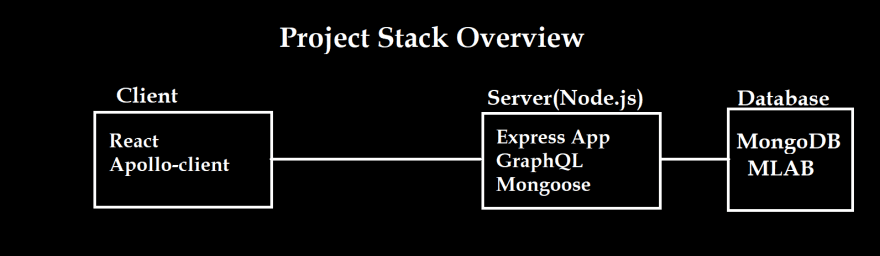

## GraphQL
1. GraphQl is a powerful query language to communicate between client and server.
2. It allows to structure data driven applications in much more flexible and effecient way compared to REST.
3. It is technology agnostic which means it can be used with technology.

## Tech stack:
- Front-End: React, Apollo
- Backend: Node.js, Express, graphQL server
- DB: MongoDB Atlas

## Steps to run

### Backend:
1. Go inside server folder
2. Run 'nodemon App'

### frontend:
1. Go inside client folder
2. Run 'npm start'

